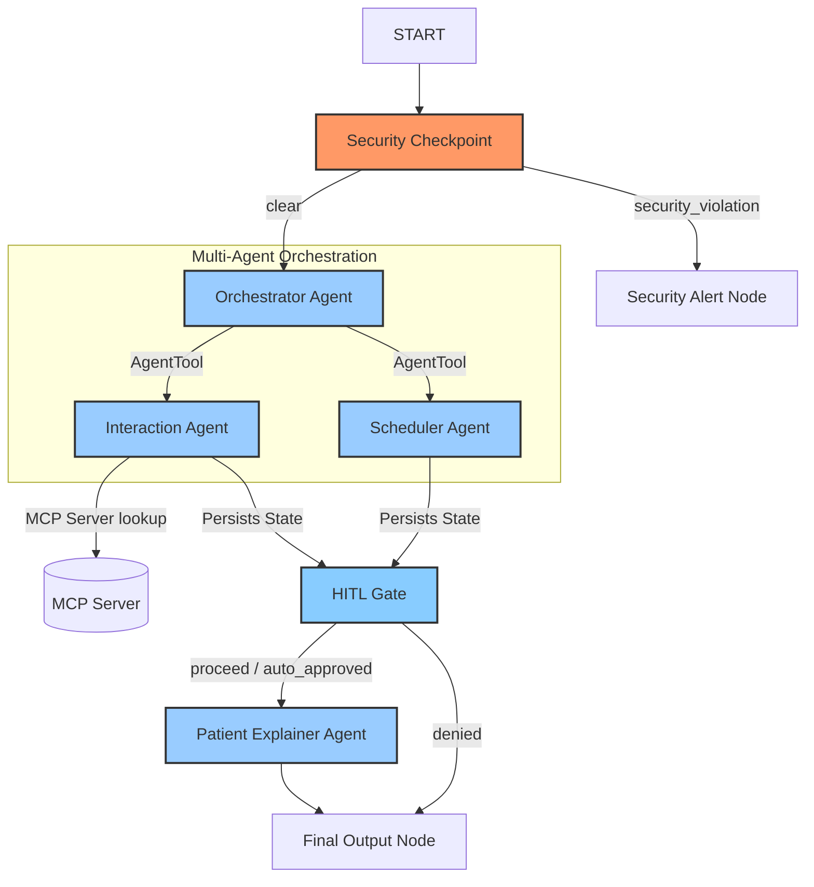

# 📝 ADK Project Submission Write-up: Med-Companion

## 1. Problem Statement
Managing complex medication regimens can be challenging and dangerous. Patients frequently face issues such as:
1. **Adherence Errors:** Missing doses due to poorly organized, confusing, or unstructured schedule guidelines.
2. **Accidental Toxicity:** Taking overlapping drug classes (like multiple NSAIDs like Aspirin and Ibuprofen) without realizing they interact.
3. **Medical Jargon Barriers:** Clinical drug interaction warnings are often written in dry, technical, or alarming terminology that leaves patients confused or anxious rather than safely informed.

Med-Companion solves this problem by providing a secure, intelligent, multi-agent assistant that parses patient queries, checks safety warnings against a pharmacopeia database, holds risky combinations for human authorization, formats clear schedules, and translates results into warm, patient-friendly guidance.

---

## 2. Solution Architecture

The application is built around a structured ADK 2.0 Workflow that implements entry-gate security checks, multi-agent orchestration, human-in-the-loop validation, and patient explainer translation.

---

## 3. Concepts Used & File References
* **ADK Workflow (2.0):** Defined in [app/agent.py](file:///c:/Users/N%20Likhith/Downloads/adk-workspace/med-companion/app/agent.py#L225-L248). Orchestrates nodes and edges via conditional routing.
* **LlmAgent:** Four instances defined in [app/agent.py](file:///c:/Users/N%20Likhith/Downloads/adk-workspace/med-companion/app/agent.py#L35-L88) (`scheduler_agent`, `interaction_agent`, `explainer_agent`, `orchestrator`) utilizing `Gemini`.
* **AgentTool:** Used in [app/agent.py](file:///c:/Users/N%20Likhith/Downloads/adk-workspace/med-companion/app/agent.py#L121-L125) to wrap specialized agents as functional tools accessible by the orchestrator.
* **MCP Server:** FastMCP server in [app/mcp_server.py](file:///c:/Users/N%20Likhith/Downloads/adk-workspace/med-companion/app/mcp_server.py) exposing simulated clinical database lookups. Wired into agents using `McpToolset` in `app/agent.py`.
* **Security Checkpoint:** Implemented as a dedicated node in [app/agent.py](file:///c:/Users/N%20Likhith/Downloads/adk-workspace/med-companion/app/agent.py#L132-L180).
* **Agents CLI:** Scaffolding, environment setup, and dependency management driven by `agents-cli` and automated via the custom [Makefile](file:///c:/Users/N%20Likhith/Downloads/adk-workspace/med-companion/Makefile).

---

## 4. Security Design
The **Security Checkpoint** sits directly after `START` to guarantee that no unsafe inputs reach the LLM agents or MCP databases. It implements:
1. **PII Scrubbing:** Uses regular expressions to redact SSNs (`\b\d{3}-\d{2}-\d{4}\b`) and phone numbers (`\b\d{3}-\d{3}-\d{4}\b`) to protect patient privacy.
2. **Prompt Injection Mitigation:** Scans queries for structural override triggers (e.g. *"ignore previous instructions"*). Detected breaches trigger the `"security_violation"` route.
3. **Abuse Keyword Filters:** Restricts searches for recreational drug manufacturing or deliberate overdoses.
4. **Structured JSON Audit Logs:** Generates a UTC timestamped JSON audit log for every scan, recorded in `ctx.state["security_audit_log"]` with appropriate severities (`INFO`, `WARNING`, `CRITICAL`).

---

## 5. MCP Server Design
The local Model Context Protocol (MCP) server in `app/mcp_server.py` implements 3 distinct tools to keep LLM agents grounded in accurate pharmacology metadata:
1. `lookup_drug_interactions(drugs)`: Cross-references drug lists against a clinical interaction database. It flags critical NSAID duplications or blood thinner overlaps.
2. `get_drug_side_effects(drug)`: Retrieves standard clinical side-effect profiles (e.g., GI bleeding for NSAIDs, hyperkalemia for Spironolactone).
3. `get_dosage_guidelines(drug)`: Provides standard FDA adult dosage guidelines.

---

## 6. Human-in-the-Loop (HITL) Flow
We implement the **`hitl_gate`** using ADK's `RequestInput` mechanism. 
* **Why it matters:** In healthcare, executing actions automatically in the presence of severe contraindications is unsafe. The system must notify and seek explicit user acknowledgment.
* **Mechanism:** When `interaction_agent` writes a `"SEVERE"` warning into `ctx.state`, `hitl_gate` intercepts the flow, yields a `RequestInput` with the warning details, and pauses.
* **Resume:** The user confirms acknowledgment in the Playground UI (checkbox). The node re-runs, detects the `approved=True` flag in the resume inputs, updates the state, and routes to the clinical explainer.

---

## 7. Demo Walkthrough
1. **Safe Path:** User enters Aspirin and Amoxicillin. The security checkpoint clears it. The Orchestrator runs safety checks (no warnings) and generates the schedule. `hitl_gate` auto-approves, and the user receives their friendly explanation.
2. **Alert Path:** User enters Aspirin and Ibuprofen. The security checkpoint clears it. The safety agent flags a severe NSAID overlap. `hitl_gate` halts execution. The user acknowledges the warning, and the system proceeds to deliver the translated safety instructions.
3. **Violation Path:** User enters a prompt injection attempt. The checkpoint immediately flags it as a `CRITICAL` severity risk, blocks execution, and returns a warning.

---

## 8. Impact & Value Statement
Med-Companion empowers patients to safely manage complex prescription regimens without falling victim to accidental double-dosing or dangerous combinations. By utilizing MCP for clinical grounding and ADK's HITL mechanism for safety, it acts as a reliable, secure patient companion. Healthcare clinics can leverage this system to reduce medication-related hospital readmissions and improve patient literacy.
